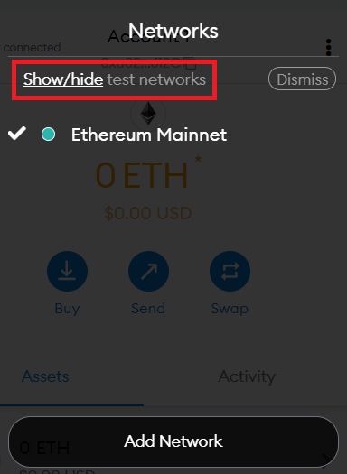
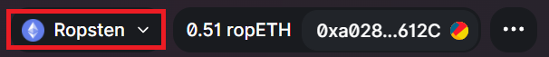

# MetaMask实践：在测试网络上交易

目前以太坊的手续费（gas fee）过高，在去中心化交易所uniswap进行一次交易的费用经常要\$50，对于资金量小于10万刀的使用者根本不合适。然而，很多优秀的应用只在以太坊上发行，例如uniswap、MakerDao等等。想要体验这些开创性、以太坊独有的应用又不想浪费那么多手续费，不妨尝试使用以太坊的测试网络。

就算有大量资金，在第一次使用新的应用的时候也难免要先使用少量资金学习一下如何操作，这就是双倍的手续费。因此建议所有新手以及英文文档没看懂的使用者先在测试网络上测试清楚不同应用的功能，再到真的网络上进行使用，以免操作失误损失大量资金。

### 1. 测试网络

老版的MetaMask是自带测试网络的，直接切换过去即可。新版的MetaMask需要打开网络选项，点击show network才可以看到测试网络。

打开测试网络之后可以选择的测试网络很多，我们就选择第一个测试网络Ropsten Testnet即可，其他的测试网络使用起来基本相同。

### 2. 获取代币

测试网络可以找其他人要免费的以太币。例如Ropsten Testnet上面可以在[Ropsten testnet faucet](https://faucet.egorfine.com/)领取代币，只需将自己的地址输入即可。

如果使用的是其他的测试网络，则在google里面搜索测试网络的名字，基本上以faucet结尾的都是可以免费领取以太币的地方。

要注意的是，测试网络的以太币**没有任何价值**。千万不要向其他人购买测试网络上的以太币，这些以太币都是免费的。

### 3. 使用以太坊上的应用

现在有了免费的以太币我们就可以去交易。以uniswap为例，我们直接去uniswap的官网上连接自己的钱包就可以进行交易了。当我们使用的是测试网络的时候，uniswap会在右上角显示出我们使用的是测试网络。

当然，不是所有应用网站都能支持测试网络，当你发现在测试网络上不能使用某个应用可能是这个网站不支持，并不是测试网络不支持。可以去eth explorer类似的地方直接调用区块链上的函数来使用这个应用。

