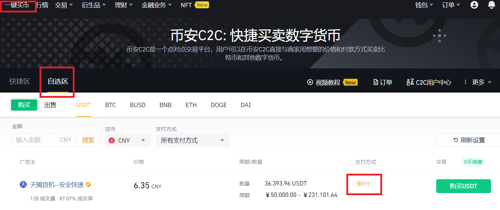
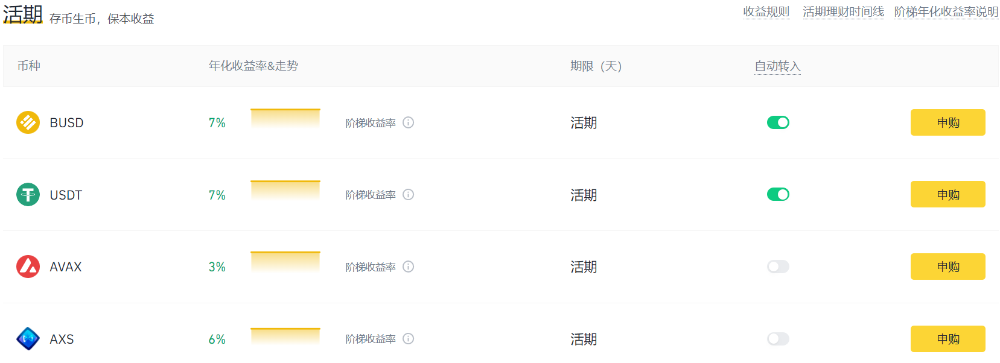

# 币安（Binance）介绍

之前的博客介绍过了如何使用加密货币钱包MetaMask，这次介绍一下如何购买加密货币，也就是加密货币的交易所。目前在中国的环境下功能最齐全，最优秀的加密货币交易所是币安（Binance），最方便使用的交易所是欧易（Okex）。博主最开始使用的是欧易交易所，但是随着加密货币的需求量加大，逐渐发现欧易的功能实在是无法满足需求，因此转而开始使用币安交易所。

### 1. 评价一个交易所

在不同国家的法律约束下评价交易所的方式也不一样。我认为在国内评价一个交易所首先要看它是否支持零手续费的P2P交易以及是否支持中国大陆用户注册，换而言之就是是否能使用人民币购买加密货币。因为不能购买加密货币那么其他的都没有意义。其次我们要考虑交易所的金融衍生品是否充足；提供的加密货币是否多样；提币的支持的网络是否足够。对于矿老板来说交易所提供的矿池也非常重要。

综上我从**币安的注册**、**购买加密货币**、**金融衍生品**、**提币网络**几个方面介绍币安。

### 2. 币安的注册

首先要说明币安需要用科学上网（VPN）来进行访问。这是币安唯一的缺点。

我们首先进入币安的官网：binance.com

需要注意的是在百度搜索币安是没有结果的，请使用google或者bing搜索币安来进入官网。进入官网后进行注册。注意如果地区没有找到中国大陆，就直接使用香港进行注册，是没有什么影响的。注册完成之后如果想要买币需要进行身份验证（KYC），需要准备身份证，人脸识别之类的信息。

完成身份验证可能要等一段时间，等待审核完成之后就可以进行交易了

### 3. 购买加密货币

如果想要使用人民币购买加密货币可以点击上方的**一键买币**，然后点击**自选区**进行购买。一定不要选择快捷区购买，否则购买到的货币会比市场价格贵很多。

可以看到有卖币的USDT商家出价。上面显示需要银行卡转账购买，还可以选择是支付宝购买或者微信购买。在购买的过程中你需要将人民币转给卖家，因此在中国会收到反诈中心的电话，电话可能会问一些问题，或者警告你不要进行转账。在币安买币只要操作正确是不会被诈骗的，因为卖家在卖给你USDT的时候币安会锁住他的USDT防止他收到人民币之后不放款。

### 4. 金融产品

币安很重要的特点在于金融产品，也就是右上角的**理财**。点击币安理财可以看到所有的理财产品。对于新手而言加密货币需要学习的知识非常多，普通的理财产品是收益最优保障而且对于利润计算有一定锻炼的项目，如果这些简单的理财产品都没看明白，复杂的DeFi收益计算更别想看明白。下面我介绍一些比较使用的理财产品。

#### 4.1 币安宝

一看“币安宝”这个名字就知道他跟余额宝差不多。但是打开之后你会发现币安宝的利息碾压余额宝，而且人家是在美元的基础上生成利息。高达$7/%$的利息也不是能无限存钱的，BUSD的存款上限为/$500，USDT的存款上限为/$2000。因此大约能存1万多块钱到里面去享受$7/%$的利息。这个存款我强烈建议所有新手都要订阅。

除了这个活期存款，币安还有定期存款和一些存款活动，如果朋友有长期持有的加密货币可以放到定期存款里面去，但是定期存款支持的币种非常少因此不要报太大的指望。

#### 4.2 BNB收益池

个人认为BNB收益池也算是一个不错的理财项目。在BNB收益池里面可以将BNB存入并且获得大约$3/%$的收入。这个收益是由币安交易所新上的货币和存款本身的收益组成的。目前币安刚刚新上了一个货币ANC，因此质押BNB到BNB收益池的用户获得分发的ANC然后折算成BNB。

#### 4.3 质押（Staking）

质押本质上和定期存款差不多，但是风险会稍微高一点点。因为质押是将货币放在区块链上质押收益都是由去中心化的平台产生的，币安并不负责运营这些平台，因此风险会稍微高一点。

除了质押这个选项我们还可以看到**DeFi挖矿**这个理财方式，这个理财方式跟质押的风险一样，但是货币都是比较主流的货币。可以看到BNB在DeFi挖矿中的收益由$5/%$因此如果由BNB使用这种理财方式也是非常好的。

#### 4.4 其他

**双币投资**是一种风险控制产品，应该是期货里面使用的一种理财产品，但是我觉得在加密货币这种价格浮动过大，没人愿意控制风险的大环境下，这种理财产品应该也没有太多市场。最多就是用来控制一下BTC和ETH的风险，感觉其他也没大用。当然，这里的风险控制我认为之后可以详细出一个数学模型来分析。

**流动性挖矿**是DeFi里面去中心化交易所使用的概念，详情可以参考[这一篇博客](https://stone-github.github.io/posts/liquidity-provider/)

