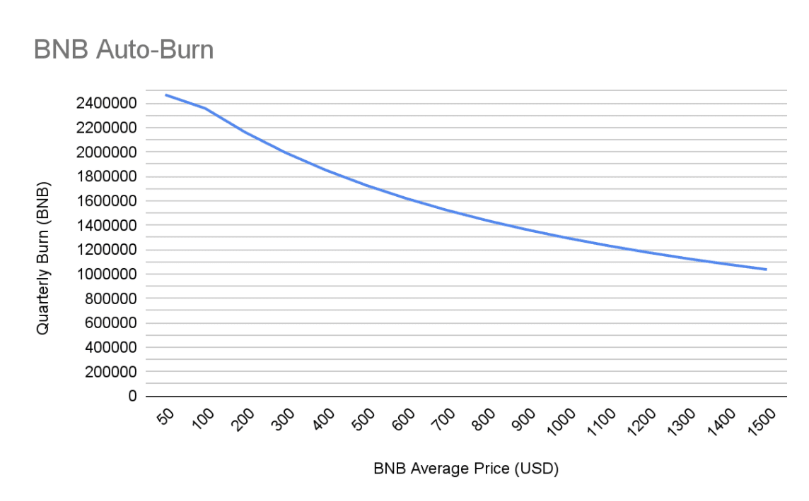

# BNB介绍

BNB是币安交易所推出的货币，该加密货币是币安交易所的重要资产和给投资者的重要服务。我会从货币的基本流通量和销毁机制讨论BNB。之后可以讨论一些BNB的实际用途。

### 1. BNB的流通量

BNB的总流通量为200,000,000（也就是两亿个）。在首次ICO之后BNB开始每个季度进行BNB的销毁。截止2022年6月9日，已经有36,680,739个BNB被销毁，还剩下大约163,000,000个BNB。目前BNB的销毁方式主要有两种，一种是季度销毁，另一种是手续费销毁（BEP95）。

### 2. BNB的销毁

在刚开始销毁时，BNB每个季度将利润的20%用来回购BNB并且进行销毁，直到销毁了50%的BNB总流通量为止。由于币安担心BNB被SEC当作债券进行审查，因此在2022年第一个季度使用了一个新的公式对BNB进行销毁。该公式如下：
$$
B = \frac{N \times 1000}{P + K}
$$
其中B该季度的总销毁量，N表示该季度BSC产出的总区块数量（大约为2,592,000），P表示平均的BNB价格（从ChainLink中获得，每10,000个区块采样一次），K表示一个常数，并且可以根据BEP进行修改，初始值为1000。这种季度的销毁方式同样在销毁了50%的BNB之后就会停止，也就是说BNB最后的流通量为100,000,000。该销毁方式跟价格强相关，因此假设K和N不变的情况下每个季度的销毁量和价格的关系如下图：

目前BNB每个季度的销毁速度保守估计为1,500,000，相比起目前的总流通量163,000,000还有42个季度（约10年）才能达成目标。

另一个销毁BNB的机制是将BSC上的手续费一部分进行销毁（BEP20）。该机制会在销毁了50%的BNB之后持续销毁。但是该机制销毁的速度非常慢，在[实时显示](https://bnbburn.info/)网站上显示过去七天才销毁了2,167个BNB，差不多一天销毁300个BNB的样子。

### 3. BNB的用途

在介绍完BNB的基础属性之后我们关注一下BNB的一些用途。首先BNB最重要的用途是在币安交易时当作手续费使用会降低25%的手续费。此外持有一定数量的BNB可以获取币安打新币的资格（本人从来不用）。具体BNB的特权和用途见币安的[官方博客](https://www.binance.com/en/bnb)。

**官方博客**：

新销毁机制介绍：https://www.binance.com/en/blog/ecosystem/introducing-bnb-autoburn-a-new-protocol-for-the-quarterly-bnb-burn-421499824684903205

实时显示销毁BNB：https://bnbburn.info/

