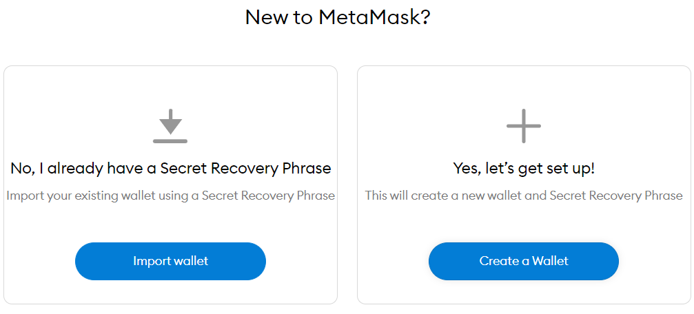

# MetaMask入门：安装和配置

我从最开始学习区块链到现在已经有两年时间。最开始我从编程入门区块链，完成了后端到前端的程序开发。之后进入了矿老板的圈子，又进入了DeFi的圈子。体验过不同的入门方式也见过了非常多的参与者，我认为不论是哪一种参与者都应该从MetaMask这一个钱包开始学习。从编程开始学习实在太过乏味，从其他角度参与又始终不理解区块链的使用价值在哪里。因此这篇博客介绍如何使用MetaMask钱包让自己成为真的区块链使用者，而不是区块链投机者。

### 1. 安装钱包

MetaMask是Chrome浏览器的一个插件，一定要在[官方网站](https://metamask.io/)下载否则其他的钓鱼网站会将资金盗取。下载完成之后在服务器右上角会看到MetaMask的图标，如下图（分别为edge浏览器和chrome浏览器）：

    

    

之后点击打开MetaMask的图标开始创建钱包。进入如下界面：

    

完成创建之后选择“Create Wallet”开始创建一个全新的钱包。如果此时你已经有了一个助记词（Secret Recovery Phrase）那就可以选择导入自己的钱包。

    

之后就是常规的填写密码之类的。需要注意的是在MetaMask中密码忘记了其实影响不是很大，可以通过助记词重新找回。也就是说在下面这个界面一定要**点击查看助记词**，然后将它**抄到纸上**，并且**反复确认是否抄错**。在后面的界面按顺序输入助记词就完成配置了。

    

成功配置后MetaMask的界面如下：

    

### 2. 加入代币（token）

在上面MetaMask的途中我们可以看到现在只有0个ETH，也就是我们没有以太币。当然我们知道在以太坊上除了以太币还有很多其他代币，例如USDT。想要加入其他代币，点击下方的import tokens，然后输入对应代币的以太坊地址或者缩写。

例如添加USDT可以输入USDT的地址0xdac17f958d2ee523a2206206994597c13d831ec7，添加USDT代币如下（请确认输入正确的地址，否则可能会丢失资金）：

    

或者输入USDT的缩写添加代币（metamask只会识别非常有名的缩写）：

    

### 3. 加入网络

MetaMask除了支持以太坊还可以支持其他的平台，只要这些平台是兼容以太坊虚拟机（EVM）的，例如Polygon、Avanche、Binance等等。想要在这些平台上进行交易需要将这些平台的网络添加到MetaMask的钱包中。需要注意的是这些平台之间的代币一般是不能流通的，需要流通的话要通过特殊的桥（bridge）来进行流通。

这里以Polygon为例，将Polygon添加到MetaMask中。添加网络首先要选择下图中的add network：

    

打开之后将对应的网络名称和其他选项填入，例如Polygon的配置如下：

* Network Name：Polygon
* New RPC URL：https://polygon-rpc.com
* Chain ID：137
* Currency Symbol：MATIC

* Block Explorer URL：https://polygonscan.com/

将上述配置填入下图对应位置：

    

再次提醒，不同网络之间的代币一般是不能流通的。例如在以太坊上面有USDT，在Polygon上面也有USDT但是两个网络上的USDT不能等价。在MetaMask中相同的地址，在以太坊上面有100个USDT，切换到Polygon网络之后只会显示0个USDT

